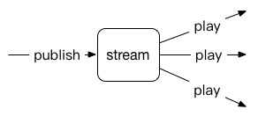
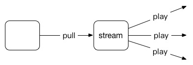
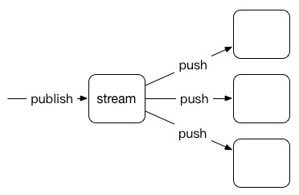

# Module ngx\_rtmp\_oclp\_module
---
## 简介

ngx\_rtmp\_oclp\_module 是 nginx rtmp 的能力开放模块，对外提供相应的通知或控制能力，用于替代 ngx\_rtmp\_notify\_module。

控制事件包含：

- proc：进程启动时通知，只支持 start 触发点
- play：有播放端接入时通知
- publish：有推流端接入时通知
- pull：触发回源拉流事件控制
- push：触发转推事件控制
- stream：流创建通知
- meta：收到音视频头通知
- record(还未支持)：启动录制通知

控制事件触发点包含：

- start：事件发生时触发，配置或不配置 start 均为默认开启状态
- update：事件持续过程中的心跳刷新
- done：事件结束时触发

扩展参数

- args：向外发送通知或控制请求时，携带的 http 请求参数
- groupid：分组，主要针对 push 或 meta，多路转推时，用于标识每路转推用
- stage：触发阶段，可选 start，update 和 done
- timeout：向外发送通知或控制请求时，等待外部响应的超时时间，默认为 3s
- update：发送 update 通知的时间间隔，默认为 1min，只有 stage 配置了 update 才生效

### 基本模型

- 当有拉流时，触发 play 通知，当拉流持续时，每隔一定时间间隔向外发送 update 通知，当拉流结束时发送 done 通知
- 当有推流时，触发 publish 通知，当推流持续时，每隔一定时间间隔向外发送 update 通知，当推流结束时发送 done 通知
- 当有一路拉流或一路推流时，触发 stream 通知，当流还继续存在时，每隔一定时间间隔向外发送 update 通知，所有推流和拉流都结束时发送 done 通知

### 拉流模型

- 当有拉流时，触发 play 通知，当拉流持续时，每隔一定时间间隔向外发送 update 通知，当拉流结束时发送 done 通知
- 当需要回源拉流时，触发 pull 控制，回源拉流创建成功后，每隔一定时间间隔向外发送 update 通知，当拉流结束时发送 done 通知
- 当有拉流时，触发 stream 通知，当流还继续存在时，每隔一定时间间隔向外发送 update 通知，所有拉流都结束时发送 done 通知

### 推流模型

- 当有推流时，触发 publish 通知，当推流持续时，每隔一定时间间隔向外发送 update 通知，当推流结束时发送 done 通知
- 当需要转推流时，触发 push 控制，转推流创建成功后，每隔一定时间间隔向外发送 update 通知，当转推流结束时发送 done 通知
- 当有推流时，触发 stream 通知，当流还继续存在时，每隔一定时间间隔向外发送 update 通知，推流结束时发送 done 通知

meta 的行为和 push 一致，只是 meta 的触发点在收到音视频头，push 触发点是收到 publish 命令，push 和 meta 是互斥的，配置了 push，meta 将不生效

## 示例

基本模型

    application test {
        live on;
        cache_time 3s;
        idle_streams off;
        oclp_publish http://127.0.0.1:6200/oclp/v1/publish stage=start,done args=a=c&b=d;
        oclp_play    http://127.0.0.1:6200/oclp/v1/play    stage=start,done args=a=c&b=d;
        oclp_stream  http://127.0.0.1:6200/oclp/v1/stream  stage=start,done args=a=c&b=d;
    }

拉流模型

    application edge {
        live on;
        cache_time 3s;
        low_latency on;
        oclp_pull     http://127.0.0.1:6200/oclp/v1/pull    stage=start,update,done args=a=c&b=d;
        pull http://101.200.241.232:11939/core app=core;
    }

推流模型

    application pub {
        live on;
        #oclp_push    http://127.0.0.1:6200/oclp/v1/push    stage=start,update,done args=a=c&b=d timeout=1s;
        oclp_meta    http://127.0.0.1:6200/oclp/v1/push    stage=start,update,done args=a=c&b=d timeout=1s;
    }

## 配置

### oclp\_proc

	Syntax: oclp_proc url [timeout=time] [update=time];
	Default: -
	Context: rtmp

进程启动时，向配置的 url 发送 http get 请求，通知时会携带 call=init\_process&worker\_id=$ngx\_worker 参数。

### oclp\_play

	Syntax: oclp_play url [args=string] [stage=[start][,update][,done]] [timeout=time] [update=time];
	Default: -
	Context: application

只能配置一条

外部拉流时，向配置的 url 发送 http get 请求，通知时会携带 call=play&act=start&domain=$domain&app=$app&name=$name，如果配置了 args，会将 args 追加到默认参数后面

如果配置了 done，拉流结束后会发送 done 通知，和初始通知区别是，act=done

如果配置了 update，拉流结束前，每隔 update 时间间隔会发送一条刷新通知，和初始通知区别是，act=update

对于初始请求，如果外部异常，将不会发送 update 请求；如果外部回送非 200 响应，将会使用 403/NetStream.Play.Forbidden 断掉拉流请求；如果外部回送 200 响应并配置了刷新，会启动 update 定时器发送刷新通知

对于刷新通知和结束通知，不对响应做处理

### oclp\_publish

	Syntax: oclp_publish url [args=string] [stage=[start][,update][,done]] [timeout=time] [update=time];
	Default: -
	Context: application

只能配置一条

外部推流时，向配置的 url 发送 http get 请求，通知时会携带 call=publish&act=start&domain=$domain&app=$app&name=$name，如果配置了 args，会将 args 追加到默认参数后面

如果配置了 done，推流结束后会发送 done 通知，和初始通知区别是，act=done

如果配置了 update，推流结束前，每隔 update 时间间隔会发送一条刷新通知，和初始通知区别是，act=update

对于初始请求，如果外部异常，将不会发送 update 请求；如果外部回送非 200 响应，将会使用 403/NetStream.Play.Forbidden 断掉拉流请求；如果外部回送 200 响应并配置了刷新，会启动 update 定时器发送刷新通知

对于刷新通知和结束通知，不对响应做处理

### oclp\_stream

	Syntax: oclp_stream url [args=string] [stage=[start][,update][,done]] [timeout=time] [update=time];
	Default: -
	Context: application

只能配置一条

流创建时(有一路推流或一路拉流时)，向配置的 url 发送 http get 请求，通知时会携带 call=stream&act=start&domain=$domain&app=$app&name=$name，如果配置了 args，会将 args 追加到默认参数后面

如果配置了 done，所有推拉流结束后会发送 done 通知，和初始通知区别是，act=done

如果配置了 update，所有推拉流结束前，每隔 update 时间间隔会发送一条刷新通知，和初始通知区别是，act=update

对于初始请求，如果外部异常或外部回送非 200 响应，将不会发送 update 请求；如果外部回送 200 响应并配置了刷新，会启动 update 定时器发送刷新通知

对于刷新通知和结束通知，不对响应做处理

### oclp\_pull

	Syntax: oclp_pull url [args=string] [stage=[start][,update][,done]] [timeout=time] [update=time];
	Default: -
	Context: application

只能配置一条

需要触发回源拉流时，向配置的 url 发送 http get 请求，通知时会携带 call=pull&act=start&domain=$domain&app=$app&name=$name，如果配置了 args，会将 args 追加到默认参数后面

如果配置了 done，relay pull session 结束后会发送 done 通知，和初始通知区别是，act=done

如果配置了 update，relay pull session 结束前，每隔 update 时间间隔会发送一条刷新通知，和初始通知区别是，act=update

对于初始请求，如果外部异常，将会启动 pull reconnect；如果外部回送 200 响应，将不会创建 relay pull session，因此后续不会有 update 和 done 通知；如果外部回送 4XX 或 5XX 响应，将会结束所有拉流请求

如果回送 3XX 响应，将会根据 Location 头构造回源请求，Location 必须是完整的 rtmp 或 http url，如 rtmp://ip/app/name[?args]，如果是 rtmp url 将会使用 rtmp 协议回源，如果是 http url 将会使用 http flv 协议回源。如果 3XX 响应中携带 Domain 头，将会使用该头构造 rtmp 的 tc_url 或 http 的 Host 头

对于刷新通知和结束通知，不对响应做处理

### oclp\_push

	Syntax: oclp_push url [args=string] [stage=[start][,update][,done]] [timeout=time] [update=time];
	Default: -
	Context: application

最多支持配置 8 条，每条对应一个 relay push session

需要触发流转推时，向配置的 url 发送 http get 请求，通知时会携带 call=push&act=start&domain=$domain&app=$app&name=$name，如果配置了 args，会将 args 追加到默认参数后面

如果配置了 done，每条 relay push session 结束后会发送 done 通知，和初始通知区别是，act=done

如果配置了 update，relay push session 结束前，每隔 update 时间间隔会发送一条刷新通知，和初始通知区别是，act=update

对于初始请求，如果外部异常，将会启动 push reconnect；如果外部回送 200 响应，将不会创建 relay push session，因此后续不会有 update 和 done 通知；如果外部回送 4XX 或 5XX 响应，将会结束推流请求

如果回送 3XX 响应，将会根据 Location 头构造回源请求，Location 必须是完整的 rtmp url，如 rtmp://ip/app/name[?args]。如果 3XX 响应中携带 Domain 头，将会使用该头构造 rtmp 的 tc_url

对于刷新通知和结束通知，不对响应做处理

### oclp\_meta

	Syntax: oclp_meta url [args=string] [stage=[start][,update][,done]] [timeout=time] [update=time];
	Default: -
	Context: application

最多支持配置 8 条，每条对应一个 relay push session

基本功能与 oclp_push 相同，只不过 oclp_push 是 publish 命令触发，oclp_meta 是音视频头触发，具体触发规则见 oclp_meta_type 和 oclp_meta_once

### oclp\_meta\_once

	Syntax: oclp_meta_once on|off;
	Default: on
	Context: rtmp, server, application

oclp_meta 通知是否只触发一次

### oclp\_meta\_type

	Syntax: oclp_meta_once video|audio|both;
	Default: video
	Context: rtmp, server, application

- video：oclp_meta 只有在收到视频头时触发
- audio：oclp_meta 只有在收到音频头时触发
- both：oclp_meta 在收到音频或视频头时均会触发